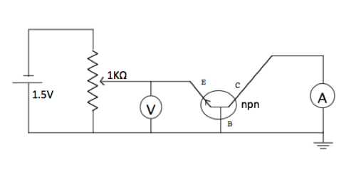

# Introduzione
Scopo dell'esercitazione è svolgere un certo numero di esperimenti per determinare rapporti di costanti fondamentali e, attraverso la loro combinazione, ottenere una misura delle costanti fondamentali $e$, $h$, $k$.

Recuperate gli schemi python per l'acquisizione con il comando:
```
   git clone https://github.com/fabrizio-parodi/LabMCS-EsVI.git EsVI
```

Nella cartella troverete:
 - modulo python (dmm.py) per leggere il multimetro Tektronics 4020
 - modulo python (ps.py) per leggere l'alimentatore
 - esempio di utilizzo (test.py)

# Misura di e/h tramite curva IV di LED

## Setup esperimento

1. Collegare un LED al generatore ponendo in serie una resistenza di 1kΩ
2. Collegare Voltmetro e Amperometro opportunamente

## Conduzione esperimento

Variando la tensione del generatore registrare   (per vari LED) misurare
``` 
V I eV eI
```
(modificare opportunamente test.py) oppure
```
V_gen V eV_gen eV
``` 
oppure ancora
```
t V eV
```
(scarica del condensatore)

 1. Definire un metodo per misurare la tensione $V_d$ (o una tensione $V'$ che differisca da essa per una costante);
 2. Misurare la lunghezza d'onda di emissione di ciascun LED;
 3. Eseguire il grafico di $V'$ rispetto a $\nu$ ed estrarre $e/h$. 

# Misura di e/k tramite curva IV di un transistor
## Setup esperimento
Realizzare il seguente circuito



(dove il generatore a tensione costante ed il potenziometro sono sostituiti dal generatore di tensione variabile), Collegare l'amperometro (vista la grande stabilità del generatore non si userà un voltmetro ma si assumerà esatto il valore settato dal generatore)

**Attenzione**: chi esegue questa esperienza deve assicurare la misura della temperatura ambientale per tutti i gruppi a cui serva questa grandezza. A tal scopo deve equipaggiare una basetta con pT100 e un programma opportuno per monitorare la temperatura ambientale.
## Conduzione dell'esperimento
Variando la tensione del generatore registrare (modifcando opportunamente test.py, il valore di tensione settato viene letto da tastiera)
```
V I eI
```
Eseguire un fit di $I$ in funzione di $V$ per determinare $e/k$.

# Misura del rapporto h/k tramite la legge di Planck del corpo nero

## Prima parte
### Setup esperimento

1. collegare la "scatola" del corpo nero al generatore ed in serie all'amperometro
2. misurare $T_{amb}$

### Conduzione esperimento

Variando la tensione del generatore registrare (modificando opportunamente test.py, il valore di tensione settato viene letto da tastiera)
```
V I  eI
```
Fit di $P = VI = \alpha R^{4\gamma}$ determinando $\gamma$ che permette di definire $$T = T_{amb}\left(\frac{(V/I)}{R_{amb}}\right)^\gamma = f(V/I).$$


## Seconda parte

Una lampadina (trascurati i piccoli effetti di conduzione) può essere considerato come un corpo nero.

L'intensità di luce emessa deve quindi dipendere dalla frequenza e dalla temperatura secondo la legge $$I(\nu,T) = \frac{2\pi h\nu^3}{c^2} \left(\exp\left(\frac{h\nu}{kT}\right) - 1 \right)^{-1}.$$

### Setup esperimento

Collegare la "scatola" del corpo nero al generatore ed in serie all'amperometro. Alimentare il fotodiodo e leggerne la tensione in uscita (proporzionale all'intensità di luce rilevata)

### Conduzione esperimento

Siccome $h\nu\gg kT$ la relazione si può approssimare con $$I(\nu,T)\sim \exp\left(-\frac{h\nu}{kT}\right).$$ Considerate due temperature diverse (ottenute alimentando la lampadina con potenze diverse) e dividendo membro a membro si ottiene $$\frac{I(T_i)}{I(T_j)} = \frac{\exp\left(\frac{h\nu}{kT_j}\right)}{\exp\left(\frac{h\nu}{kT_i}\right)}$$ e, passando al logaritmo $$\log\left(\frac{I(T_i)}{I(T_j)}\right) = \frac{h\nu}{k}\left(\frac{1}{T_j} - \frac{1}{T_i}\right).$$ Se $I$ è proporzionale alla tensione in uscita dal fotodiodo $$\log\left(\frac{V_{fd, i}}{V_{fd,j}}\right) = \frac{h\nu}{k}\left(\frac{1}{T_j} - \frac{1}{T_i}\right)$$

Variando la tensione del generatore (modificando opportunamente test.py, il valore di tensione settato viene letto da tastiera) si misuri I e la tensione del fotodiodo salvando in un file dal formato
```
V    I   eI   Vfd  eVfd
```
Per ogni valore di $V/I$ si calcoli $T = f(V/I)$ e si esegua quindi un fit alla funzione sopra riportata determinando $h/k$.
